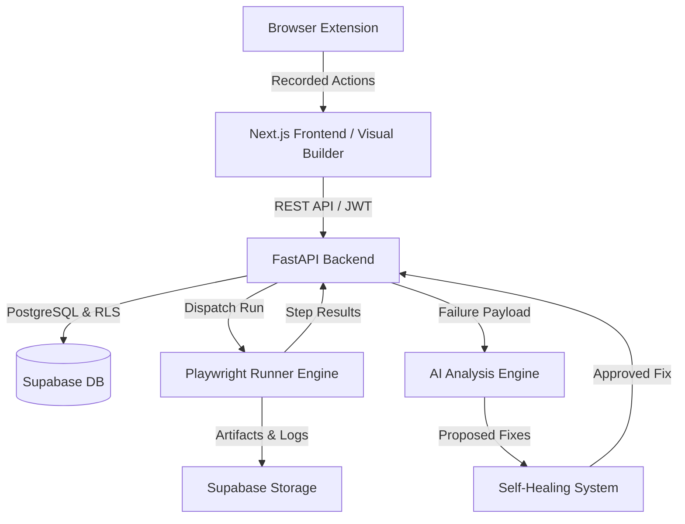
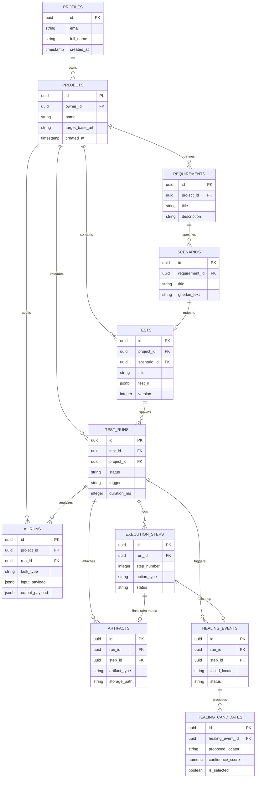

# TestPilot AI — Database Schema & API Contract Specification

**Document Version:** 1.0.0  
**Phase:** Foundation (Day 2, Week 1)  
**Author:** Senior Backend Architect (Developer 3)  
**Status:** Approved Architecture Blueprint  

---

## 1. Purpose & Architecture Context

### 1.1 Purpose
This document specifies the canonical database schema, entity relationship model, Supabase integration patterns, and REST API contract for **TestPilot AI** — an AI-powered, no-code Web test automation platform.

This specification serves as the formal architectural blueprint for all three engineering streams:
- **Developer 1 (Frontend & Browser Extension)**: Dashboard, Visual Test Builder, Extension recording, Reporting.
- **Developer 2 (Test Engine & AI/Healing)**: Test IR schema parsing, Playwright test execution runner, Locator engine, AI scenario generator, Self-healing engine.
- **Developer 3 (Backend & Database Architecture)**: Database migrations, FastAPI services, Supabase Auth/RLS, REST API handlers, Storage management.

### 1.2 System Architecture Overview



---

## 2. Database Entities Blueprint

The relational schema comprises **11 core entities**. All table identifiers use standard `uuid` primary keys generated via PostgreSQL `gen_random_uuid()`. Timestamps use `timestamp with time zone` (`timestamptz`).

---

### 2.1 `profiles`
- **Purpose**: Extends Supabase `auth.users` with application-level user metadata.
- **Primary Key**: `id` (`uuid`, references `auth.users(id)` ON DELETE CASCADE).
- **Foreign Keys**: `id` -> `auth.users.id`.
- **Important Fields**:
  - `email` (`text`, NOT NULL, UNIQUE)
  - `full_name` (`text`, NULLABLE)
  - `avatar_url` (`text`, NULLABLE)
  - `created_at` (`timestamptz`, DEFAULT `now()`, NOT NULL)
  - `updated_at` (`timestamptz`, DEFAULT `now()`, NOT NULL)
- **Relationships**: One Profile owns zero or more `projects`.
- **Indexes**: `idx_profiles_email` ON `profiles(email)`.
- **Security**: Access enforced via Supabase Auth. Users can only SELECT/UPDATE their own profile row (`auth.uid() = id`).

---

### 2.2 `projects`
- **Purpose**: Multi-tenant isolation container for tests, requirements, runs, and artifacts.
- **Primary Key**: `id` (`uuid`, DEFAULT `gen_random_uuid()`).
- **Foreign Keys**: `owner_id` (`uuid`, references `profiles(id)` ON DELETE CASCADE).
- **Important Fields**:
  - `name` (`text`, NOT NULL)
  - `description` (`text`, NULLABLE)
  - `target_base_url` (`text`, NOT NULL)
  - `created_at` (`timestamptz`, DEFAULT `now()`, NOT NULL)
  - `updated_at` (`timestamptz`, DEFAULT `now()`, NOT NULL)
- **Relationships**: Belongs to `profiles`. Has many `tests`, `requirements`, and `test_runs`.
- **Indexes**: `idx_projects_owner_id` ON `projects(owner_id)`.
- **Security**: RLS enforces `owner_id = auth.uid()`.

---

### 2.3 `tests`
- **Purpose**: Defines automated test cases, storing metadata and canonical Test IR JSON.
- **Primary Key**: `id` (`uuid`, DEFAULT `gen_random_uuid()`).
- **Foreign Keys**: 
  - `project_id` (`uuid`, references `projects(id)` ON DELETE CASCADE)
  - `scenario_id` (`uuid`, references `scenarios(id)` ON DELETE SET NULL, NULLABLE)
- **Important Fields**:
  - `title` (`text`, NOT NULL)
  - `description` (`text`, NULLABLE)
  - `status` (`text`, NOT NULL, DEFAULT `'draft'`, CHECK `status IN ('draft', 'active', 'archived')`)
  - `test_ir` (`jsonb`, NOT NULL, DEFAULT `'{}'::jsonb`)
  - `version` (`integer`, NOT NULL, DEFAULT 1)
  - `created_at` (`timestamptz`, DEFAULT `now()`, NOT NULL)
  - `updated_at` (`timestamptz`, DEFAULT `now()`, NOT NULL)
- **Relationships**: Belongs to `projects`. Optionally maps to a `scenarios`. Has many `test_runs`.
- **Indexes**: 
  - `idx_tests_project_id` ON `tests(project_id)`
  - `idx_tests_scenario_id` ON `tests(scenario_id)`
- **Security**: RLS checks project ownership (`project_id IN (SELECT id FROM projects WHERE owner_id = auth.uid())`).

---

### 2.4 `requirements`
- **Purpose**: High-level product specifications / user stories for coverage analysis.
- **Primary Key**: `id` (`uuid`, DEFAULT `gen_random_uuid()`).
- **Foreign Keys**: `project_id` (`uuid`, references `projects(id)` ON DELETE CASCADE).
- **Important Fields**:
  - `title` (`text`, NOT NULL)
  - `description` (`text`, NOT NULL)
  - `external_ref` (`text`, NULLABLE) — e.g. Jira issue ID
  - `created_at` (`timestamptz`, DEFAULT `now()`, NOT NULL)
- **Relationships**: Belongs to `projects`. Has many `scenarios`.
- **Indexes**: `idx_requirements_project_id` ON `requirements(project_id)`.
- **Security**: RLS enforced via project ownership.

---

### 2.5 `scenarios`
- **Purpose**: Gherkin/BDD acceptance scenarios generated by AI or defined by QA.
- **Primary Key**: `id` (`uuid`, DEFAULT `gen_random_uuid()`).
- **Foreign Keys**: `requirement_id` (`uuid`, references `requirements(id)` ON DELETE CASCADE).
- **Important Fields**:
  - `title` (`text`, NOT NULL)
  - `gherkin_text` (`text`, NOT NULL)
  - `status` (`text`, NOT NULL, DEFAULT `'draft'`, CHECK `status IN ('draft', 'approved', 'converted')`)
  - `created_at` (`timestamptz`, DEFAULT `now()`, NOT NULL)
- **Relationships**: Belongs to `requirements`. Has zero or one mapped `tests`.
- **Indexes**: `idx_scenarios_requirement_id` ON `scenarios(requirement_id)`.
- **Security**: RLS enforced via parent requirement's project ownership.

---

### 2.6 `test_runs`
- **Purpose**: Represents an execution instance of a test case.
- **Primary Key**: `id` (`uuid`, DEFAULT `gen_random_uuid()`).
- **Foreign Keys**: 
  - `test_id` (`uuid`, references `tests(id)` ON DELETE CASCADE)
  - `project_id` (`uuid`, references `projects(id)` ON DELETE CASCADE)
- **Important Fields**:
  - `trigger` (`text`, NOT NULL, CHECK `trigger IN ('manual', 'ci', 'scheduled', 'ai_verify')`)
  - `status` (`text`, NOT NULL, DEFAULT `'pending'`, CHECK `status IN ('pending', 'running', 'passed', 'failed', 'error', 'cancelled')`)
  - `started_at` (`timestamptz`, NULLABLE)
  - `completed_at` (`timestamptz`, NULLABLE)
  - `duration_ms` (`integer`, NULLABLE)
  - `error_message` (`text`, NULLABLE)
  - `environment` (`jsonb`, NOT NULL, DEFAULT `'{"browser": "chromium"}'::jsonb`)
  - `created_at` (`timestamptz`, DEFAULT `now()`, NOT NULL)
- **Relationships**: Belongs to `tests` and `projects`. Has many `execution_steps`, `healing_events`, `artifacts`, and `ai_runs`.
- **Indexes**: 
  - `idx_test_runs_test_id` ON `test_runs(test_id)`
  - `idx_test_runs_project_id` ON `test_runs(project_id)`
  - `idx_test_runs_status` ON `test_runs(status)`
- **Security**: RLS enforced via project ownership.

---

### 2.7 `execution_steps`
- **Purpose**: Fine-grained log of every step executed during a test run.
- **Primary Key**: `id` (`uuid`, DEFAULT `gen_random_uuid()`).
- **Foreign Keys**: `run_id` (`uuid`, references `test_runs(id)` ON DELETE CASCADE).
- **Important Fields**:
  - `step_number` (`integer`, NOT NULL)
  - `action_type` (`text`, NOT NULL) — e.g. `click`, `fill`, `assert_text`
  - `target_locator` (`text`, NULLABLE)
  - `status` (`text`, NOT NULL, CHECK `status IN ('passed', 'failed', 'skipped')`)
  - `duration_ms` (`integer`, NOT NULL, DEFAULT 0)
  - `error_log` (`text`, NULLABLE)
  - `created_at` (`timestamptz`, DEFAULT `now()`, NOT NULL)
- **Relationships**: Belongs to `test_runs`. May link to step-level `artifacts`.
- **Indexes**: `idx_execution_steps_run_id` ON `execution_steps(run_id)`.
- **Security**: RLS enforced via parent test run's project ownership.

---

### 2.8 `ai_runs`
- **Purpose**: Audit trail for all AI tasks (scenario generation, IR generation, failure analysis, self-healing).
- **Primary Key**: `id` (`uuid`, DEFAULT `gen_random_uuid()`).
- **Foreign Keys**: 
  - `project_id` (`uuid`, references `projects(id)` ON DELETE CASCADE)
  - `run_id` (`uuid`, references `test_runs(id)` ON DELETE SET NULL, NULLABLE)
- **Important Fields**:
  - `task_type` (`text`, NOT NULL, CHECK `task_type IN ('scenario_gen', 'test_gen', 'failure_analysis', 'self_healing')`)
  - `prompt_tokens` (`integer`, DEFAULT 0)
  - `completion_tokens` (`integer`, DEFAULT 0)
  - `model_name` (`text`, NOT NULL)
  - `status` (`text`, NOT NULL, CHECK `status IN ('running', 'completed', 'failed')`)
  - `input_payload` (`jsonb`, NOT NULL)
  - `output_payload` (`jsonb`, NULLABLE)
  - `created_at` (`timestamptz`, DEFAULT `now()`, NOT NULL)
- **Relationships**: Belongs to `projects`. Optionally references a `test_runs`.
- **Indexes**: `idx_ai_runs_project_id` ON `ai_runs(project_id)`.
- **Security**: Secrets redacted from payload. RLS enforced via project ownership.

---

### 2.9 `healing_events`
- **Purpose**: Records locator/element failure events that triggered self-healing logic.
- **Primary Key**: `id` (`uuid`, DEFAULT `gen_random_uuid()`).
- **Foreign Keys**: 
  - `run_id` (`uuid`, references `test_runs(id)` ON DELETE CASCADE)
  - `step_id` (`uuid`, references `execution_steps(id)` ON DELETE CASCADE)
- **Important Fields**:
  - `failed_locator` (`text`, NOT NULL)
  - `status` (`text`, NOT NULL, DEFAULT `'pending'`, CHECK `status IN ('pending', 'approved', 'rejected', 'auto_applied')`)
  - `failure_reason` (`text`, NULLABLE)
  - `dom_snapshot_path` (`text`, NULLABLE) — path in Supabase Storage
  - `created_at` (`timestamptz`, DEFAULT `now()`, NOT NULL)
- **Relationships**: Belongs to `test_runs` and `execution_steps`. Has many `healing_candidates`.
- **Indexes**: 
  - `idx_healing_events_run_id` ON `healing_events(run_id)`
  - `idx_healing_events_step_id` ON `healing_events(step_id)`
- **Security**: RLS enforced via parent test run's project ownership.

---

### 2.10 `healing_candidates`
- **Purpose**: Candidate locators suggested by AI/Self-Healing engine for a failure event.
- **Primary Key**: `id` (`uuid`, DEFAULT `gen_random_uuid()`).
- **Foreign Keys**: `healing_event_id` (`uuid`, references `healing_events(id)` ON DELETE CASCADE).
- **Important Fields**:
  - `proposed_locator` (`text`, NOT NULL)
  - `confidence_score` (`numeric(3, 2)`, NOT NULL) — e.g. `0.95`
  - `strategy_used` (`text`, NOT NULL) — e.g. `semantic_similarity`, `xpath_fallback`, `attribute_match`
  - `is_selected` (`boolean`, DEFAULT FALSE)
  - `created_at` (`timestamptz`, DEFAULT `now()`, NOT NULL)
- **Relationships**: Belongs to `healing_events`.
- **Indexes**: `idx_healing_candidates_event_id` ON `healing_candidates(healing_event_id)`.
- **Security**: RLS enforced via parent healing event's project ownership.

---

### 2.11 `artifacts`
- **Purpose**: Metadata for binary/text execution files stored in Supabase Storage.
- **Primary Key**: `id` (`uuid`, DEFAULT `gen_random_uuid()`).
- **Foreign Keys**: 
  - `run_id` (`uuid`, references `test_runs(id)` ON DELETE CASCADE)
  - `step_id` (`uuid`, references `execution_steps(id)` ON DELETE CASCADE, NULLABLE)
- **Important Fields**:
  - `artifact_type` (`text`, NOT NULL, CHECK `artifact_type IN ('screenshot', 'video', 'trace', 'dom_snapshot', 'network_har')`)
  - `storage_path` (`text`, NOT NULL) — Bucket relative path
  - `file_size_bytes` (`integer`, NOT NULL)
  - `content_type` (`text`, NOT NULL)
  - `created_at` (`timestamptz`, DEFAULT `now()`, NOT NULL)
- **Relationships**: Belongs to `test_runs` and optionally an `execution_steps`.
- **Indexes**: 
  - `idx_artifacts_run_id` ON `artifacts(run_id)`
  - `idx_artifacts_step_id` ON `artifacts(step_id)`
- **Security**: RLS enforced via parent test run's project ownership. Storage downloads served via signed URLs.

---

## 3. Entity Relationship Model & Hierarchies

### 3.1 Primary Entity Hierarchies

1. **User & Project Hierarchy**:
   `profiles` (1) ───< `projects` (N) ───< `tests` (N) ───< `test_runs` (N) ───< `execution_steps` (N)

2. **Requirements & Scenarios Hierarchy**:
   `projects` (1) ───< `requirements` (N) ───< `scenarios` (N) ───(0..1) `tests`

3. **Self-Healing Subsystem**:
   `test_runs` (1) ───< `healing_events` (N) ───< `healing_candidates` (N)

4. **Artifact Storage Subsystem**:
   `test_runs` (1) ───< `artifacts` (N)

---

## 4. Test IR Architectural Decision

### 4.1 Canonical Test Intermediate Representation (Test IR)
**Test IR** is the technology-agnostic, canonical JSON specification for automated tests in TestPilot AI.

### 4.2 Decoupled Architecture
```
    ┌─────────────────────────┐
    │ Browser Extension /     │
    │ Visual Builder (Dev 1)  │
    └────────────┬────────────┘
                 │ Emits / Edits
                 ▼
          ┌─────────────┐
          │   Test IR   │  <=== Saved in tests.test_ir (JSONB)
          └──────┬──────┘
                 │ Consumed By
    ┌────────────┴────────────┐
    │  Playwright Execution   │
    │     Engine (Dev 2)      │
    └─────────────────────────┘
```

- **Database Independence**: The `tests` table stores `test_ir` as a structured `jsonb` object.
- **Engine Isolation**: The database schema does **NOT** contain Playwright-specific code, CSS selectors implementation details, or node.js script strings.
- **Transformation Pipeline**:
  1. Extension records user actions -> outputs Test IR JSON.
  2. AI generates scenario tests -> outputs Test IR JSON.
  3. Playwright Runner compiles Test IR JSON -> executes Playwright browser actions dynamically.
  4. Self-Healing modifies locators -> updates Test IR JSON structure.

---

## 5. Supabase Integration Architecture

### 5.1 Storage vs Database Rows Rule
> **CRITICAL RULE**: Binary files, raw video streams, Playwright `.zip` traces, network HAR files, and full HTML DOM trees MUST **NEVER** be stored directly inside database table text columns.

```
       Supabase Service
      ┌────────────────┐
      │ Supabase Auth  │ ──> Identifies User (JWT)
      └───────┬────────┘
              │
      ┌───────▼────────┐
      │ PostgreSQL DB  │ ──> Stores Structured Metadata & References
      └───────┬────────┘
              │
      ┌───────▼────────┐
      │ Supabase       │ ──> Stores Screenshots, Videos, Traces, DOM
      │ Storage Bucket │     (Bucket: 'test-artifacts')
      └────────────────┘
```

---

## 6. REST API Contract Specification

All endpoints require HTTP header `Authorization: Bearer <JWT_TOKEN>` unless explicitly noted as Public.

---

### 6.1 System Endpoints

#### `GET /health`
- **Purpose**: Process health check.
- **Auth**: Public
- **Response `200 OK`**:
  ```json
  {
    "status": "ok",
    "service": "testpilot-backend"
  }
  ```

#### `GET /health/db`
- **Purpose**: Database connectivity check.
- **Auth**: Public
- **Response `200 OK`**:
  ```json
  {
    "status": "ok",
    "database": "connected"
  }
  ```

---

### 6.2 Project Management Endpoints

#### `GET /projects`
- **Purpose**: List user's projects.
- **Auth**: Bearer JWT
- **Response `200 OK`**:
  ```json
  {
    "data": [
      {
        "id": "123e4567-e89b-12d3-a456-426614174000",
        "name": "E-Commerce App",
        "description": "Production test suite",
        "target_base_url": "https://example.com",
        "created_at": "2026-08-31T10:00:00Z"
      }
    ]
  }
  ```

#### `POST /projects`
- **Purpose**: Create a project.
- **Auth**: Bearer JWT
- **Request Body**:
  ```json
  {
    "name": "E-Commerce App",
    "description": "Production test suite",
    "target_base_url": "https://example.com"
  }
  ```
- **Response `201 Created`**: Returns project record.

#### `GET /projects/{id}`
- **Purpose**: Get project details by ID.
- **Auth**: Bearer JWT
- **Response `200 OK`**: Returns single project record.

#### `PATCH /projects/{id}`
- **Purpose**: Update project settings.
- **Auth**: Bearer JWT
- **Request Body**: Partial project object (`name`, `description`, `target_base_url`).
- **Response `200 OK`**: Returns updated project.

#### `DELETE /projects/{id}`
- **Purpose**: Delete a project and all cascading resources.
- **Auth**: Bearer JWT
- **Response `204 No Content`**

---

### 6.3 Test Management Endpoints

#### `GET /projects/{id}/tests`
- **Purpose**: List all tests belonging to a project.
- **Auth**: Bearer JWT
- **Response `200 OK`**: List of tests.

#### `POST /projects/{id}/tests`
- **Purpose**: Create a test case with Test IR.
- **Auth**: Bearer JWT
- **Request Body**:
  ```json
  {
    "title": "Login with valid credentials",
    "description": "Verifies successful login flow",
    "scenario_id": null,
    "test_ir": {
      "version": "1.0",
      "steps": [
        { "action": "navigate", "url": "/login" },
        { "action": "fill", "target": "#username", "value": "testuser" },
        { "action": "click", "target": "#submit" }
      ]
    }
  }
  ```
- **Response `201 Created`**: Returns created test object.

#### `GET /tests/{id}`
- **Purpose**: Fetch test details including full Test IR.
- **Auth**: Bearer JWT
- **Response `200 OK`**: Test details object.

#### `PATCH /tests/{id}`
- **Purpose**: Update test title, description, or Test IR.
- **Auth**: Bearer JWT
- **Response `200 OK`**: Updated test object.

#### `DELETE /tests/{id}`
- **Purpose**: Delete test.
- **Auth**: Bearer JWT
- **Response `204 No Content`**

---

### 6.4 Execution Endpoints

#### `POST /tests/{id}/runs`
- **Purpose**: Trigger a test execution run.
- **Auth**: Bearer JWT
- **Request Body**:
  ```json
  {
    "trigger": "manual",
    "environment": {
      "browser": "chromium",
      "headless": true
    }
  }
  ```
- **Response `202 Accepted`**:
  ```json
  {
    "run_id": "987e6543-e89b-12d3-a456-426614174000",
    "status": "pending",
    "message": "Test execution dispatched successfully"
  }
  ```

#### `GET /runs/{id}`
- **Purpose**: Fetch status, steps, and artifacts for an execution run.
- **Auth**: Bearer JWT
- **Response `200 OK`**:
  ```json
  {
    "id": "987e6543-e89b-12d3-a456-426614174000",
    "test_id": "123e4567-e89b-12d3-a456-426614174000",
    "status": "passed",
    "duration_ms": 1420,
    "steps": [
      { "step_number": 1, "action_type": "navigate", "status": "passed", "duration_ms": 320 }
    ],
    "artifacts": [
      { "artifact_type": "screenshot", "storage_path": "runs/987e6543/step_1.png" }
    ]
  }
  ```

#### `GET /tests/{id}/runs`
- **Purpose**: Get execution run history for a test.
- **Auth**: Bearer JWT
- **Response `200 OK`**: List of test runs.

---

### 6.5 AI & Scenario Endpoints

#### `POST /ai/plan`
- **Purpose**: Generate BDD scenarios from requirement description using AI.
- **Auth**: Bearer JWT
- **Request Body**:
  ```json
  {
    "project_id": "123e4567-e89b-12d3-a456-426614174000",
    "requirement_id": "550e8400-e29b-41d4-a716-446655440000",
    "prompt_instructions": "Generate edge case scenarios for checkout flow"
  }
  ```
- **Response `200 OK`**: Returns generated scenarios list.

#### `POST /ai/generate-test`
- **Purpose**: Convert a scenario into a executable Test IR structure.
- **Auth**: Bearer JWT
- **Request Body**:
  ```json
  {
    "scenario_id": "550e8400-e29b-41d4-a716-446655440000"
  }
  ```
- **Response `201 Created`**: Returns created test object containing `test_ir`.

---

### 6.6 Analysis & Self-Healing Endpoints

#### `POST /runs/{id}/analyze`
- **Purpose**: Perform AI failure analysis on a failed test run.
- **Auth**: Bearer JWT
- **Response `200 OK`**: Returns root-cause analysis and created healing event.

#### `POST /healing/{id}/approve`
- **Purpose**: Approve a self-healing candidate locator fix and update Test IR.
- **Auth**: Bearer JWT
- **Request Body**:
  ```json
  {
    "candidate_id": "770e8400-e29b-41d4-a716-446655440000"
  }
  ```
- **Response `200 OK`**:
  ```json
  {
    "status": "approved",
    "healing_event_id": "id",
    "updated_test_version": 2
  }
  ```

#### `POST /healing/{id}/reject`
- **Purpose**: Reject a proposed self-healing locator fix.
- **Auth**: Bearer JWT
- **Response `200 OK`**: Returns updated healing event status (`rejected`).

---

### 6.7 Coverage & Reporting Endpoints

#### `GET /projects/{id}/coverage`
- **Purpose**: Compute requirement-to-test mapping and test pass-rate coverage metrics.
- **Auth**: Bearer JWT
- **Response `200 OK`**:
  ```json
  {
    "project_id": "123e4567-e89b-12d3-a456-426614174000",
    "total_requirements": 10,
    "covered_requirements": 8,
    "coverage_percentage": 80.0,
    "pass_rate": 92.5
  }
  ```

---

## 7. Standardized Request/Response & Error Conventions

### 7.1 Standard Success Envelope
All successful API responses return direct JSON data or an object wrapping `data`:
```json
{
  "data": { ... }
}
```

### 7.2 Standard Error Envelope
All error responses MUST conform strictly to the standard error structure:
```json
{
  "error": {
    "code": "PROJECT_NOT_FOUND",
    "message": "Project with ID '123e4567' was not found",
    "details": null
  }
}
```

### 7.3 Standard Error Codes Dictionary
| Error Code | HTTP Status | Description |
| :--- | :--- | :--- |
| `UNAUTHORIZED` | 401 | Missing or invalid JWT token |
| `FORBIDDEN` | 403 | User does not own the project |
| `RESOURCE_NOT_FOUND` | 404 | Project, test, or run not found |
| `VALIDATION_ERROR` | 422 | Invalid payload or missing fields |
| `HEALING_FAILED` | 400 | Candidate locator invalid or outdated |
| `INTERNAL_SERVER_ERROR` | 500 | Unhandled backend exception |

---

## 8. Database Migration Sequence

SQL migration files will be created in `backend/app/db/migrations/` in the following strict order:

```
001_create_profiles.sql                 (Base Auth integration)
  │
002_create_projects.sql                 (Multi-tenant ownership)
  │
003_create_tests.sql                    (Test IR & Metadata)
  │
004_create_requirements_and_scenarios.sql (Coverage & BDD Specs)
  │
005_create_test_runs_and_execution_steps.sql (Execution Log Engine)
  │
006_create_ai_runs.sql                  (AI Audit Trail)
  │
007_create_healing_events_and_candidates.sql (Self-Healing Engine)
  │
008_create_artifacts.sql                (Storage Metadata Links)
```

---

## 9. Security Design & RLS Model

1. **Row Level Security (RLS)**: Enforced on all tables in Supabase PostgreSQL:
   ```sql
   ALTER TABLE projects ENABLE ROW LEVEL SECURITY;
   CREATE POLICY "User project access policy" ON projects
     FOR ALL USING (owner_id = auth.uid());
   ```
2. **Service Role Isolation**: Backend FastAPI uses `SUPABASE_KEY` (anon key) for user-authenticated calls. Service role credentials are stored only on the backend server for background tasks and are **NEVER** exposed to frontend code.
3. **Signed URLs**: Screenshots, traces, and video recordings in Supabase Storage buckets are served using short-lived signed URLs generated via FastAPI backend endpoints.

---

## 10. Indexing Strategy

To maintain sub-millisecond query latency across millions of execution logs, the following explicit indexes are specified:

- `projects.owner_id`: Speeds up dashboard project listing per user.
- `tests.project_id`: Speeds up test suite filtering.
- `tests.scenario_id`: Speeds up requirement coverage lookup.
- `test_runs.test_id` & `test_runs.project_id`: Speeds up historical test run trend queries.
- `test_runs.status`: Speeds up active execution queue monitoring.
- `execution_steps.run_id`: Speeds up step-by-step test log rendering.
- `healing_events.run_id` & `healing_events.step_id`: Speeds up failure analysis lookup.
- `healing_candidates.healing_event_id`: Speeds up locator suggestion fetching.
- `artifacts.run_id`: Speeds up test run report media loading.

---

## 11. Complete Mermaid ER Diagram



---

## 12. Cross-Team Review & Alignment Checklist

- [x] **Developer 1 (Frontend/Extension)**: Schema supports Extension recording payload, Visual Builder Test IR editing, dashboard reporting, and healing approval UI.
- [x] **Developer 2 (Test Engine/Playwright/AI)**: Schema provides clean `test_ir` storage, step-by-step logging, artifact references, and self-healing candidate tracking.
- [x] **Developer 3 (Backend Architecture)**: Migration ordering defined, RLS policies outlined, API endpoints specified, response envelopes standardized.

---

## 13. Validation Criteria Checklist

1. Can one user own multiple projects? **YES** (`profiles` 1 -> N `projects`).
2. Can one project contain multiple tests? **YES** (`projects` 1 -> N `tests`).
3. Can one test have multiple executions? **YES** (`tests` 1 -> N `test_runs`).
4. Can each execution contain multiple steps? **YES** (`test_runs` 1 -> N `execution_steps`).
5. Can requirements have multiple scenarios? **YES** (`requirements` 1 -> N `scenarios`).
6. Can scenarios map to tests? **YES** (`scenarios` 0..1 -> `tests`).
7. Can an execution generate healing events? **YES** (`test_runs` 1 -> N `healing_events`).
8. Can one healing event have multiple candidates? **YES** (`healing_events` 1 -> N `healing_candidates`).
9. Can artifacts belong to executions/steps? **YES** (`artifacts` FKs to `test_runs` & `execution_steps`).
10. Can AI operations be audited? **YES** (`ai_runs` table tracks tokens, prompts, outputs).
11. Can coverage be calculated later? **YES** (`GET /projects/{id}/coverage` over requirements & tests).
12. Can Test IR remain independent of Playwright? **YES** (Stored in `jsonb`, converted at runtime).
13. Can RLS later enforce project ownership? **YES** (`owner_id = auth.uid()` cascading RLS policies).

---

## 14. Future Considerations & Open Questions

1. **RBAC / Organization Accounts**: Future support for multi-user organization accounts sharing projects.
2. **Visual Regression Baselines**: Adding baseline screenshot reference IDs to `tests` for visual diffing.
3. **Live Logs Streaming**: WebSocket endpoint `WS /runs/{id}/stream` for real-time terminal output streaming during Playwright execution.
